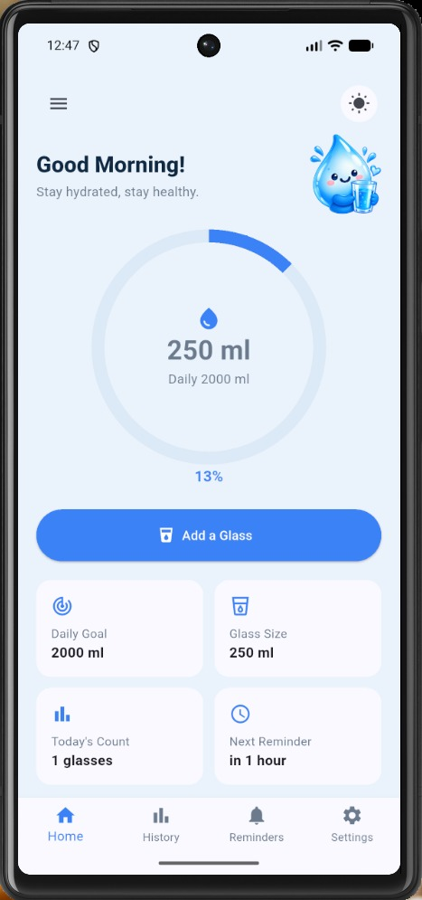
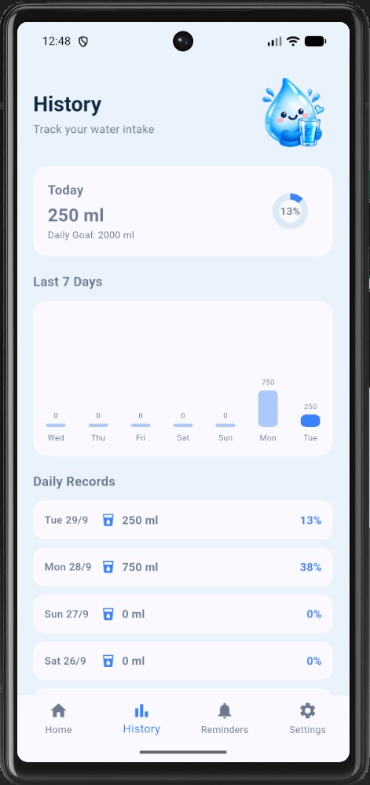
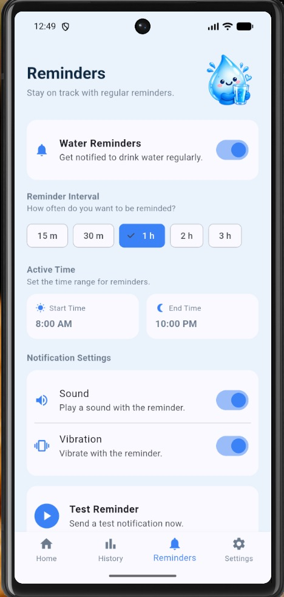
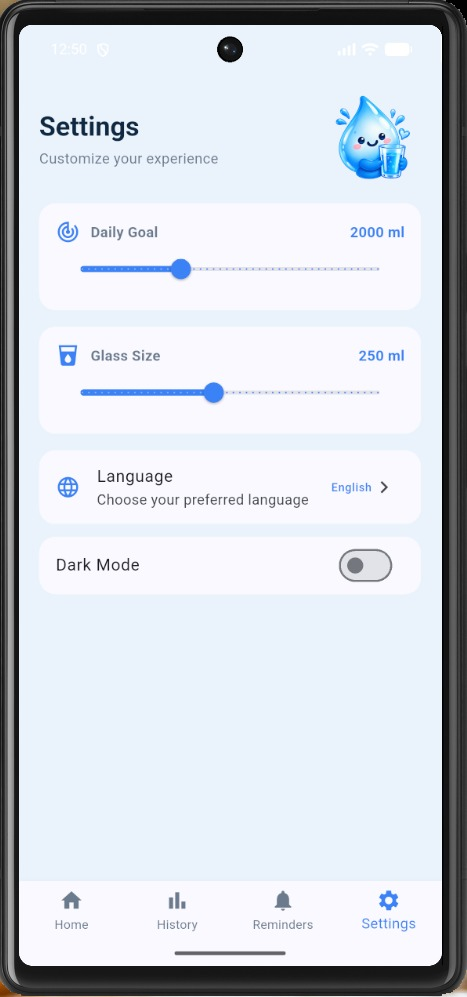
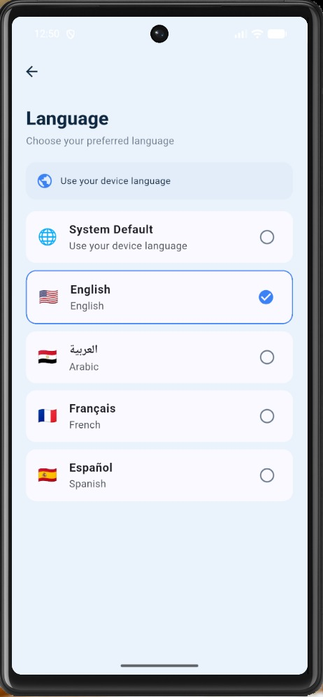
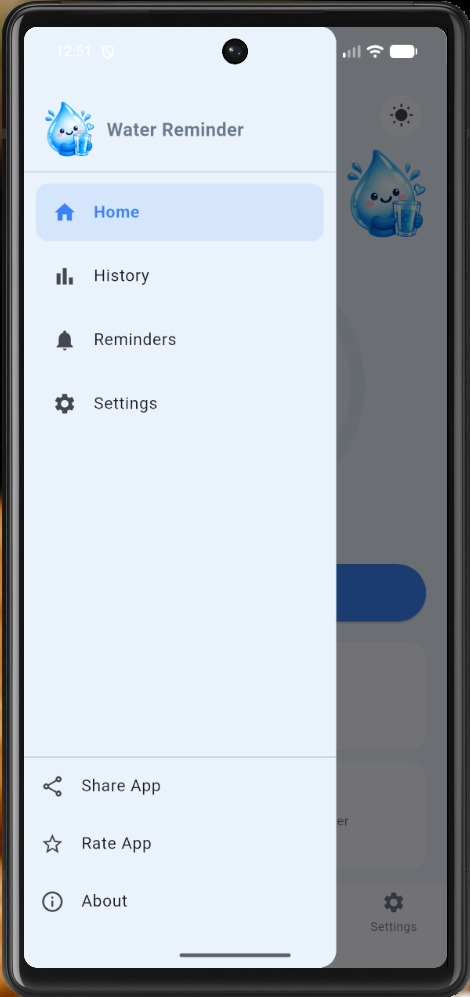
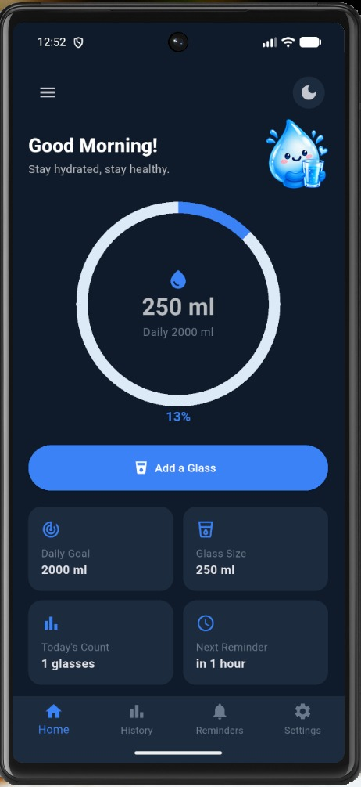
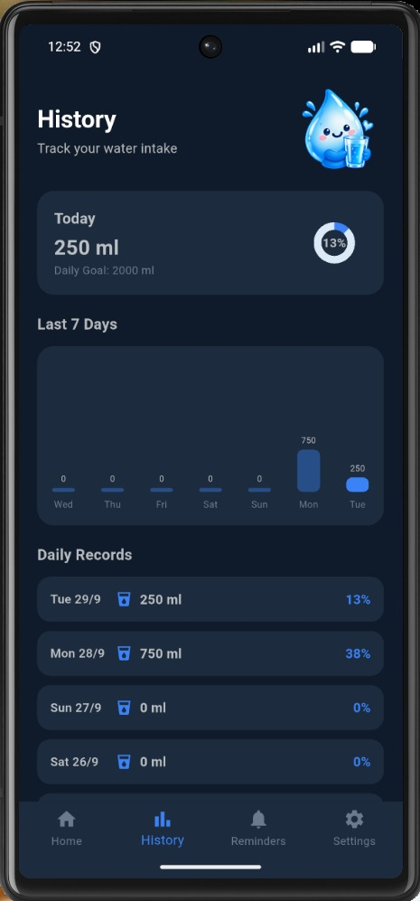
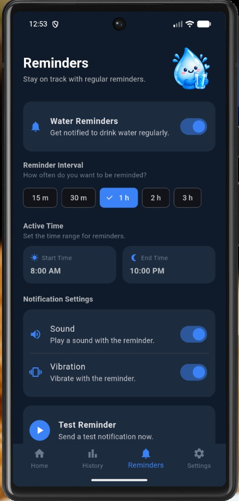

# AquaGo

A simple and modern water reminder application built with Flutter.

AquaGo helps users track their daily water intake, set personalized water goals, receive drinking reminders, and monitor their hydration history through a clean and user-friendly interface.

## Screenshots

### Light Mode

#### Home


#### History


#### Reminders


#### Settings


#### Language


#### Drawer


### Dark Mode

#### Home


#### History


#### Reminders


## Features

- Track daily water consumption
- Set and customize daily water goals
- Customize glass size
- View water intake history
- Daily, weekly, monthly and yearly statistics
- Customizable water reminders
- Set reminder start and end times
- Notification sound settings
- Vibration settings
- Light Mode and Dark Mode
- Multi-language support
- Automatically adapt to the device language
- Store user data locally
- Google Mobile Ads integration
- Clean and modern UI

## Technologies

- Flutter
- Dart
- Provider
- SharedPreferences
- Flutter Local Notifications
- Google Mobile Ads
- Intl
- Permission Handler
- Share Plus
- URL Launcher

## Project Structure

lib/
data/
l10n/
screens/
state/
theme/
main.dart

assets/
images/
icon/

screenshots/
android/

## Getting Started

### Requirements

- Flutter SDK
- Dart SDK
- Android Studio or VS Code
- Android device or emulator

### Install Dependencies

```bash
flutter pub get